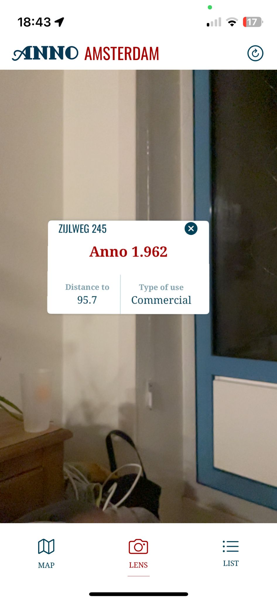
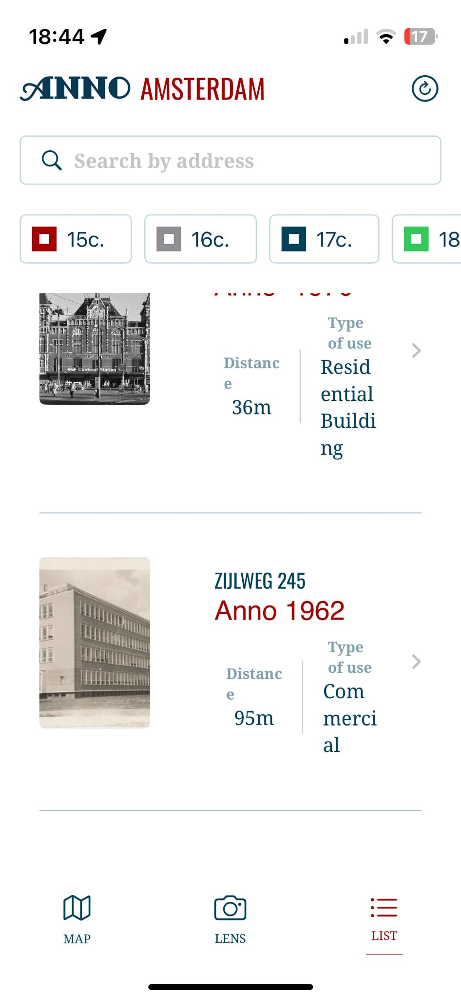

# The Reader

A mobile application for the residents & tourists of Amsterdam to discover and learn more about the historic buildings using AR.

## Screenshots

<table>
  <tr>
    <td align="center" width="33%">
       
      <em>Map page of historical buildings</em>
    </td>
    <td align="center" width="33%">
       
      <em>AR page of buildings around you</em>
    </td>
    <td align="center" width="33%">
       
      <em>List page of historical buildings</em>
    </td>
  </tr>
  <tr>
    <td align="center" width="33%">
       
      <em>Search results at the list page</em>
    </td>
    <td align="center" width="33%">
       
      <em>Details page</em>
    </td>
    <td align="center" width="33%">
       
      <em>Image details page</em>
    </td>
  </tr>
</table>

## Clients Vision

The history about buildings in Amsterdam
To view them …
- on an Map
- in an List
- with AR & your camera (optional)
- in detail
The ability to …
- filter by centuries 
- search by address 
- see buildings based on your location
- have an onboarding

## Code insights

Usage of CocoaPods ​

Transforming UIKit Screens to SwiftUI (for the AR Feature)​

Location & Keyboard Manager​

Usage of …​

- two API endpoints​
- local models and API-models​
- animations​

Error Handling:

- for empty data​
- for API-Request errors​

​

​

​

​
